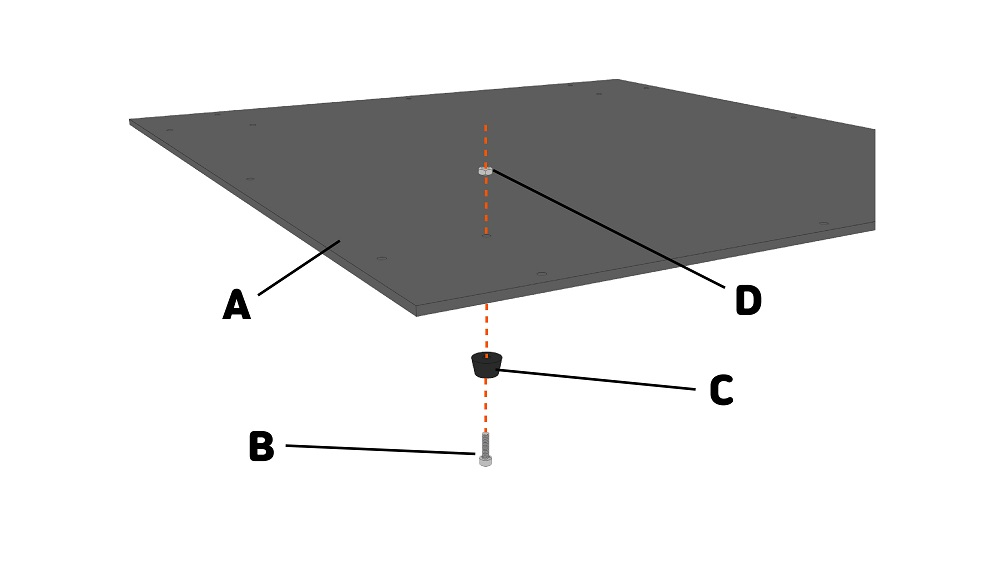
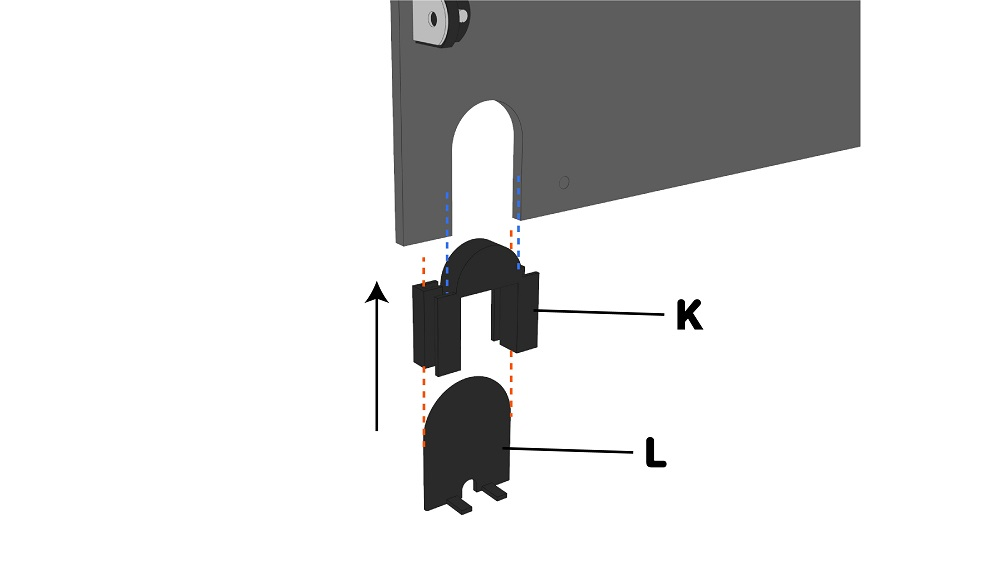
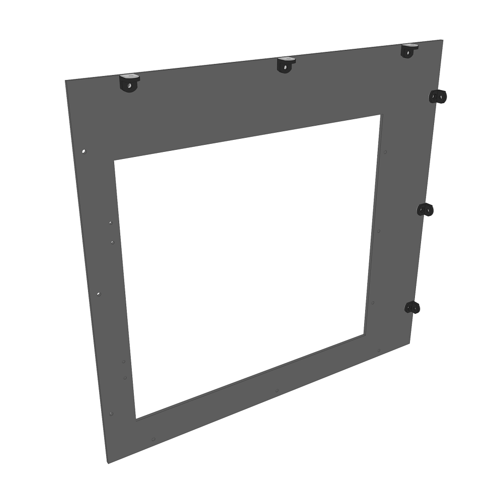
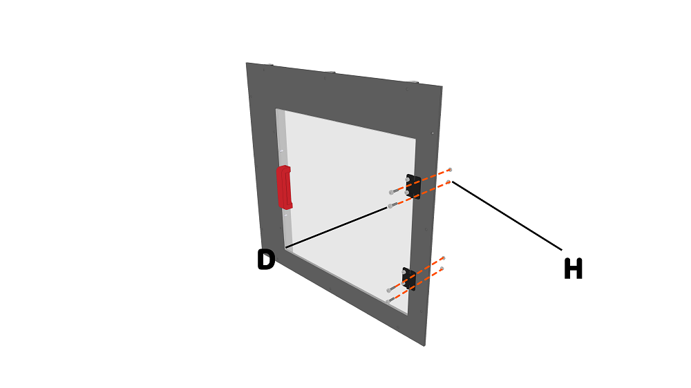

조립하기_1
++++++++++++++++

.. raw:: html

    

.. role:: orangecircle
.. role:: blackcircle
.. role:: bluecircle
.. role:: yellowcircle
.. role:: subtitle
.. role:: blackbold

|
| :subtitle:`Step.1`

.. image:: ../images/Chamber/step_1.jpg
   :width: 800

| :orangecircle:`●` 밑판을 준비합니다. 밑판의 특징은 테두리 부분 이외에 모서리마다 3개의 홀과 꼭지점에 총 4개의 홈만 있는 것입니다.

|
| :subtitle:`Step.2`

| :orangecircle:`●` 고무받침대(C)를 M4너트(D)와 M4-10볼트(B)를 이용하여 밑판(A)에 체결해줍니다.

|
| :subtitle:`Step.3`

| :orangecircle:`●` 그림과 같이 밑판의 4군데 모두 체결해줍니다.

|
| :subtitle:`Step.4`

| :orangecircle:`●` 꺽쇠(F)와 M4너트(D), 브라켓(E)의 순서대로 조립해줍니다. 
| :yellowcircle:`●` M4너트(D)는 브라켓(E)의 너트홈에 삽입되도록 합니다.
| :blackcircle:`●` 브라켓(E)는 검정색을 사용해줍니다.

|
| :subtitle:`Step.5`

.. image:: ../images/Chamber/step_5.jpg
   :width: 800

| :blackcircle:`●` Step.4에서 조립된 브라켓(G)을 밑판의 테두리 부분의 홀에 체결해줍니다.
| :orangecircle:`●` 체결 순서는 M4너트(D) - 조립된 브라켓(G) - M4-10볼트(H) 순으로 조립해줍니다.

|
| :subtitle:`Step.6`

.. image:: ../images/Chamber/step_6.jpg
   :width: 800

| :blackcircle:`●` 4군데의 모서리 부근에 있는 총 12개의 홀에 모두 조립된 브라켓을 조립해줍니다.

|
| :subtitle:`Step.7`

.. image:: ../images/Chamber/step_7.png
   :width: 800

| :blackcircle:`●` 뒷판을 준비합니다. 뒷판의 특징은 큰 원형 홀이 있는 것입니다.

|
| :subtitle:`Step.8`

.. image:: ../images/Chamber/step_8.png
   :width: 800

| :blackcircle:`●` 뒷판에도 조립된 브라켓(step.4)을 아랫 모서리를 제외하고 모두 조립해줍니다.

|
| :subtitle:`Step.9`

| :blackcircle:`●` 필터와 필터 케이스를 M4-50 볼트(J)를 이용하여, 체결해줍니다.

| :orangecircle:`●` 필터(I)를 M4-50 볼트(J)를 이용하여, 뒷판에 체결해줍니다.
| :blackcircle:`●` 체결할때 필터에는 전선이 빠져나오는 홈(I-2)이 있습니다. 이 홈이 아랫쪽으로 가도록 합니다.

|
| :subtitle:`Step.10`

| :bluecircle:`●` 전원선 도어 브라켓(K)을 뒷판의 아래쪽에 삽입해줍니다.
| :orangecircle:`●` 전원선 도어(L)를 전원선 도어 브라켓(K)의 아래에서 삽입해줍니다.
| :blackcircle:`●` 전원선 도어(L)의 아랫부분을 그림과 같은 방향으로 삽입합니다.

|
| :subtitle:`Step.11`

| :blackcircle:`●` 옆판을 준비합니다. 옆판은 창문이 들어갈 큰 홈이 있는 것입니다.

|
| :subtitle:`Step.12`

| :blackcircle:`●` 옆판에도 조립된 브라켓(step.4)을 아랫, 뒷 모서리를 제외하고 모두 조립해줍니다.

|
| :subtitle:`Step.13`

.. image:: ../images/Chamber/step_13.png
   :width: 800

| :blackcircle:`●` 문 지지대(M)를 준비합니다. 
| :orangecircle:`●` 옆판에 M4-15볼트(H), 옆판, 문 지지대(M), M4너트(D) 순으로 조립해줍니다.

|
| :subtitle:`Step.14`

.. image:: ../images/Chamber/step_14.jpg
   :width: 800

| :blackcircle:`●` 아크릴 3개중 작은 아크릴(O)을 준비합니다. 
| :blackcircle:`●` '밖'이라고 표시된 부분면을 확인하고 비닐을 벗겨줍니다.
| :orangecircle:`●` M4-15볼트(H)와 경첩(N), 아크릴(O), M4너트(D) 순으로 조립해줍니다.
| :blackcircle:`●` 아크릴의 '밖'이라고 표시된 면에 경첩이 조립되도록 아크릴의 방향을 맞춰줍니다.

|
| :subtitle:`Step.15`

.. image:: ../images/Chamber/step_15.jpg
   :width: 800

| :bluecircle:`●` M3너트(D)를 문 손잡이(P)의 위아래로 삽입해줍니다.

|
| :subtitle:`Step.16`

.. image:: ../images/Chamber/step_16.jpg
   :width: 800

| :orangecircle:`●` 문 손잡이(P)-작은 아크릴(O)-M3-15볼트(H)의 순서로 조립해줍니다.

|
| :subtitle:`Step.17`

| :blackcircle:`●` Step.16에서 조립된 아크릴을 옆판에 그림과 같이 삽입해주고,
| :orangecircle:`●` M4-15볼트(D) - 경첩 - 옆판 - M4너트(H) 순으로 조립해줍니다.
| :blackcircle:`●` 반대편 옆판에도 Step.11~Step.17을 반복합니다.

|
| :subtitle:`Step.18`

| :orangecircle:`●` 윗판을 준비합니다. 윗판의 특징은 가운데 홀 2개와 한쪽모서리의 긴 홈이 있는 것입니다.
| :yellowcircle:`●` 윗판에는 디스플레이 선이 통과되는 홈이 있습니다. 이 홈이 앞쪽으로 오도록 합니다.

|
| :subtitle:`Step.19`

.. image:: ../images/Chamber/step_19.jpg
   :width: 800

.. image:: ../images/Chamber/step_19_2.jpg
   :width: 800

| :orangecircle:`●` M3-8볼트(Q) - 윗판 - LED 브라켓(R) - M3-너트(R) 순으로 조립해줍니다.
| :yellowcircle:`●` 구멍의 위치는 그림에 표시된 부분으로 4군데 모두 조립해줍니다.

|
| :subtitle:`Step.20`

| :blackcircle:`●` LED(T)를 LED 브라켓에 체결해줍니다.
| :yellowcircle:`●` LED의 전선이 왼쪽으로 오도록 그림과 같이 LED(T)를 체결해줍니다.

|
| :subtitle:`Step.21`

.. image:: ../images/Chamber/step_21.jpg
   :width: 800

| :orangecircle:`●` Step.4에서 조립된 브라켓을 윗판의 앞쪽에 2개만 조립해줍니다.

|
| :subtitle:`Step.22`

| :blackcircle:`●` 기존 메탈 V2 프린터에서 디스플레이와 필라멘트 거치대를 분리합니다.

| :blackcircle:`●` 디스플레이도 볼트를 풀어 하단을 분리해줍니다.

|
| :subtitle:`Step.23`

.. image:: ../images/Chamber/step_23.png
   :width: 800

| :blackcircle:`●` 빨간색 브라켓(W)을 조립하여 준비합니다. 
| :orangecircle:`●` 디스플레이(V)와 빨간색 브라켓(W)과 M3-15볼트(U)를 순서대로 조립해줍니다.
| :blackcircle:`●` M3-15볼트(U)는 2개를 사용하여 디스플레이의 양쪽에 조립해줍니다.

|
| :subtitle:`Step.24`

.. image:: ../images/Chamber/step_24.jpg
   :width: 800

| :orangecircle:`●` 윗판의 중앙에 필라멘트 거치대도 조립해줍니다.
| :blackcircle:`●` 2개의 구멍 중에 큰 구멍에 체결해줍니다.

|
| :subtitle:`Step.25`

| :blackcircle:`●` 앞판을 준비해줍니다. 앞판은 네모난 홈이 2개 있는 것이 특징입니다.
| :blackcircle:`●` 작은 네모난 홈이 왼쪽 상단으로 위치한 것이 앞으로 와야합니다.

|
| :subtitle:`Step.26`

.. image:: ../images/Chamber/step_26.jpg
   :width: 800

| :orangecircle:`●` 온도, 습도센서를 끼워줍니다.
| :blackcircle:`●` 그림과 같이 삽입해주고, 방향에 주의하세요.

|
| :subtitle:`Step.27`

.. image:: ../images/Chamber/step_27.png
   :width: 800

| :blackcircle:`●` 앞판의 뒷면에 문 지지대(Y)를 놓아줍니다. 
| :orangecircle:`●` M4-15볼트(H) - 앞판 - 문 지지대(Y) - M4너트(D)를 순서대로 조립해줍니다.

|
| :subtitle:`Step.28`

.. image:: ../images/Chamber/step_28.jpg
   :width: 800

| :blackcircle:`●` 앞문 아크릴(X)를 준비합니다. 앞문 아크릴은 큰 아크릴입니다.
| :blackcircle:`●` '앞'이라고 표시된 부분면을 확인하고 비닐을 벗겨줍니다.
| :orangecircle:`●` M4-15볼트(H) - 경첩(N) - 아크릴(X) - M4너트(D)를 순서대로 조립해줍니다.
| :blackcircle:`●` 아크릴의 '앞'이라고 표시된 면에 경첩이 조립되도록 아크릴의 방향을 맞춰줍니다.

|
| :subtitle:`Step.29`

.. image:: ../images/Chamber/step_29.jpg
   :width: 800

| :bluecircle:`●` 손잡이(P)에 M3너트(D)를 삽입해줍니다.
| :orangecircle:`●` M3-15볼트(H) - 아크릴 - 손잡이(P)를 순서대로 조립해줍니다.
| :blackcircle:`●` Step.28에서 아크릴의 '앞'이라고 표시된 면에 손잡이가 오도록 합니다.

|
| :subtitle:`Step.30`

.. image:: ../images/Chamber/step_30.jpg
   :width: 800

| :bluecircle:`●` Step.29에서 조립된 아크릴을 앞판에 조립해줍니다.
| :orangecircle:`●` M4-15볼트(H) - 경첩 - 앞판 - M4너트(D)를 순서대로 조립해줍니다.